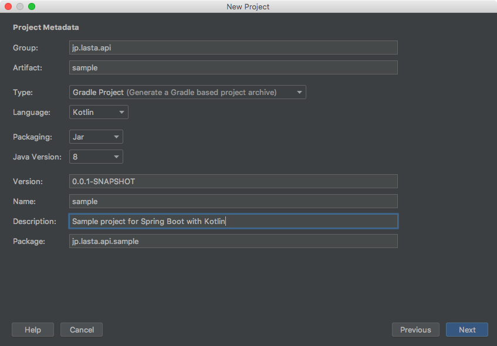

# Spring Boot 2 に Kotlin で入門してみた - 1. 環境構築編
新規でAPIサーバを作りたくなり、Spring Boot 2 を用いて作成してみます。
Kotlin Fest 2018で、Kotlin でも [Kotlin ネイティブなフレームワーク(ktorなど)][ktor] ではなくて [Java ネイティブなフレームワーク][Kotlin Fest 2018] を使うのがおすすめという話があったので、 Spring Boot 2 を選びました。

入門時の私のスキルは下記の通りです。

* Java : 2年半 (サーバサイド、コンバータ)
* Kotlin : 1年 (コンバータ)
* サーバサイドJava : 2年半 (独自フレームワーク)
* IntelliJ IDEA : 1年半
* Spring Boot : 未経験

上述の通り、 Spring Boot は未経験のため、誤りがある可能性があります。
誤りがあった際には、ご指摘いただけると嬉しいです!
一方で完全に未経験のため、同様にこれから始める方の参考になると思います。

[ktor]: https://qiita.com/lasta/items/2c25ae5a875ba8da4f8a
[Kotlin Fest 2018]: http://tech.connehito.com/entry/2018/08/31/131552

## 参考書
* [Spring徹底入門 Spring FrameworkによるJavaアプリケーション開発](https://www.amazon.co.jp/gp/product/B01IEWNLBU/ref=oh_aui_d_detailpage_o01_?ie=UTF8&psc=1)

## 1. Setup Spring Boot 2 with Kotlin
### 環境
* Java 1.8
* Kotlin 1.2.60
* IntelliJ IDEA ULTIMATE 2018-2

### Setup Project
* Open IntelliJ IDEA
* File -> New -> Project 
* New Project -> Spring Initializr
  * Project SDK : 1.8
  * Choose Initializr Service URL : Default
* Project Metadata
  * Group : com.lasta.api (任意)
  * Artifact : sample (任意)
  * Type : Gradle Project
    * Maven のほうが好きな場合は Maven Project
    * Maven POM や Gradle Config にすると `pom.xml` や `build.gralde` のみ生成されて IDEA Project が生成されないので、初心者の方は避けたほうが良いです
  * 
* Dependencies
  * 多すぎてよく把握していないので、必要そうなもののみチェックを入れます
    * あとから `pom.xml` や `build.gradle` に記述すれば追加できます
  * Spring Boot : 2.0.5 (執筆時現在最新安定版)
  * Core
    * [DevTools](https://docs.spring.io/spring-boot/docs/2.0.5.RELEASE/reference/htmlsingle/#using-boot-devtools)
      * 開発がよりやりやすくなるらしい
    * Lombok
      * アノテーションライブラリ
      * いわゆる「おまじない」(boilerplate code) を減らせる
    * [Configuration Processor](https://docs.spring.io/spring-boot/docs/2.0.5.RELEASE/reference/htmlsingle/#configuration-metadata-annotation-processor)
      * 自作の設定項目を追加できる
    * Validation
      * GET リクエストのパラメータ等のバリデーションを記述できる
  * Web
    * [Web](https://docs.spring.io/spring-boot/docs/2.0.5.RELEASE/reference/htmlsingle/#boot-features-developing-web-applications)
      * Apache Tomcat + Spring MVC を用いた Web 開発
      * Core - Validation もこれに含まれている
    * Rest Repositories
      * Spring MVC を用いて RESTful なエンドポイントを作れる
    * REST Docs
      * コード内に記述したドキュメントを用いて RESTful サービスのAPI仕様書を自動生成できる
  * Template Engine
    * Thymeleaf
      * Spring Boot でよく使われるテンプレートエンジン
  * SQL
    * JPA
      * Java persistence API
      * `spring-data-jpa` 、 `spring-orm` 、 `Hibernate` を含む
    * MySQL
      * MySQL 用 JDBC Driver
    * (用いるDBに対応するJDBCドライバをここで選択する)
  * NoSQL
    * Elasticsearch
    * Solr
    * (MongoDB や Redis, Cassandra など、用いたい NoSQL はここで選択する):w
  * [Integration](http://spring.io/projects/spring-integration)
    * [Spring Integration](https://docs.spring.io/spring-boot/docs/2.0.5.RELEASE/reference/htmlsingle/#boot-features-integration)
      * Spring Framework の拡張
      * POJO や DI 周りを特により高度に扱うことができる ?
  * Ops
    * [Actuator](https://docs.spring.io/spring-boot/docs/2.0.5.RELEASE/reference/htmlsingle/#production-ready)
    * IntelliJ IDEA で API 一覧化やヘルスチェックの追加の指定ができるようになるので、基本的に用いたほうが良い
* Project Name : sample (任意)
* Project location : `~/repos/sample` (任意)
* Finish!


* Import module from Gradle
  * Use auto-import のみチェックをいれて OK を押下

## 動作確認
ここまで行うと、 Gradle, Maven ともにライブラリのダウンロードが始まります。
完了次第、動作確認をしましょう。

1. Gradle を開く
2. sample -> Tasks -> application -> bootRun
   * または、 `./gradlew bootRun`
3. `Started SampleApplicationKt in 13.181 seconds (JVM running for 13.865)` などのようなログが出力されればOK

### SQL カテゴリのライブラリを使用する場合
依存ライブラリに `spring-boot-starter--data-jpa` がある (`pom.xml` または `build.gradle` に記載がある)場合、DBの接続情報を設定ファイル (`src/main/resources/application.properties`) に記載しないとエラーを吐いて起動に失敗します。
一時的に依存関係から削除してあげればOKです。

```groovy:一時的にJPA, MySQLを用いないようにする
dependencies {
    compile('org.springframework.boot:spring-boot-starter-actuator')
    compile('org.springframework.boot:spring-boot-starter-data-elasticsearch')
//    compile('org.springframework.boot:spring-boot-starter-data-jpa') // <-- ここをコメントアウト
    compile('org.springframework.boot:spring-boot-starter-data-rest')
    compile('org.springframework.boot:spring-boot-starter-data-solr')
    compile('org.springframework.boot:spring-boot-starter-integration')
    compile('org.springframework.boot:spring-boot-starter-thymeleaf')
    compile('org.springframework.boot:spring-boot-starter-web')
    compile('com.fasterxml.jackson.module:jackson-module-kotlin')
    compile("org.jetbrains.kotlin:kotlin-stdlib-jdk8")
    compile("org.jetbrains.kotlin:kotlin-reflect")
    runtime('org.springframework.boot:spring-boot-devtools')
//     runtime('mysql:mysql-connector-java')                           // <-- ここをコメントアウト
    compileOnly('org.springframework.boot:spring-boot-configuration-processor')
    compileOnly('org.projectlombok:lombok')
    testCompile('org.springframework.boot:spring-boot-starter-test')
    testCompile('org.springframework.restdocs:spring-restdocs-mockmvc')
}
```
