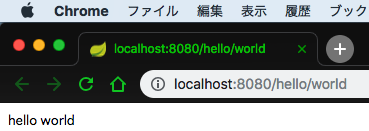

# Spring Boot 2 に Kotlin で入門してみた - 2. Hello World 編
[1. 環境構築編](https://qiita.com/lasta/items/4279a01f205f9cc5e0d4) の続きになります。

新規でAPIサーバを作りたくなり、Spring Boot 2 を用いて作成してみます。
Kotlin Fest 2018で、Kotlin でも [Kotlin ネイティブなフレームワーク(ktorなど)][ktor] ではなくて [Java ネイティブなフレームワーク][Kotlin Fest 2018] を使うのがおすすめという話があったので、 Spring Boot 2 を選びました。

入門時の私のスキルは下記の通りです。

* Java : 2年半 (サーバサイド、コンバータ)
* Kotlin : 1年 (コンバータ)
* サーバサイドJava : 2年半 (独自フレームワーク)
* IntelliJ IDEA : 1年半
* Spring Boot : 未経験

上述の通り、 Spring Boot は未経験のため、誤りがある可能性があります。
誤りがあった際には、ご指摘いただけると嬉しいです!
一方で完全に未経験のため、同様にこれから始める方の参考になると思います。

目標は、 Solr を用いて検索した結果をもとに MySQL からデータを取得して返却する API を作成することとしました。

[ソースコードは Github に置きました][github]

[ktor]: https://qiita.com/lasta/items/2c25ae5a875ba8da4f8a
[Kotlin Fest 2018]: http://tech.connehito.com/entry/2018/08/31/131552
[github]: https://github.com/lasta/sample-spring-boot-kotlin/tree/qiita/2-helloworld

## 参考書
* [Spring徹底入門 Spring FrameworkによるJavaアプリケーション開発](https://www.amazon.co.jp/gp/product/B01IEWNLBU/ref=oh_aui_d_detailpage_o01_?ie=UTF8&psc=1)

## 2. Hello World 編
### エントリポイント
Hello World を返却するAPIの前に、エントリポイントの解説のみします。
エントリポイントは `src/main/kotlin/com/lasta/api/sample/SampleApplication.kt` の `main` 関数になります。
この関数はプロジェクト作成時に自動作成され、下記のような実装になっています。

```kotlin:SampleApplication.kt
package com.lasta.api.sample

import org.springframework.boot.autoconfigure.SpringBootApplication
import org.springframework.boot.runApplication

@SpringBootApplication
class SampleApplication

fun main(args: Array<String>) {
    runApplication<SampleApplication>(*args)
}
```

この実装に関する解説は [こちら](https://spring.io/guides/gs/spring-boot/) にあります。(Java)
ひとつひとつ訳します。
[こちらの記事](https://spring-boot-camp.readthedocs.io/ja/latest/01-HelloWorld.html) も参考にしました。

* `@SpringBootApplication`
    * 下記3つのアノテーションをあわせたもの
    * `@Configuration`
        * この関数配下のパッケージの bean クラス (`@Bean` アノテーションつきのメソッド) をアプリケーションのコンテキストに追加する
            * DI コンテナに Bean を登録する
    * `@EnableAutoConfiguration`
        * Spring Boot 起動時に自動設定群を有効化する
    * `@ComponentScan`
        * Spring がこの関数配下のパッケージの Component, Configuration, Service を読み込み、 Controller がアクセスできるようにする
        * 探せるアノテーションは下記
            * `@org.springframework.stereotype.Component`
            * `@org.springframework.stereotype.Controller`
            * `@org.springframework.stereotype.Service`
            * `@org.springframework.stereotype.Repository`
            * `@org.springframework.stereotype.Configuration`
            * `@org.springframework.stereotype.RestController`
            * `@org.springframework.stereotype.ControllerAdvice`
            * `@javax.annotation.ManagedBean`
            * `@javax.inject.Named`
* `SpringBootApplication#runApplication`
    * Spring Boot アプリケーションを起動する

ここまでで DI や Bean を始めとした用語が出てきていますが、これについては今後の記事で解説します。
「Spring Boot DI」等で Google や Qiita で検索するとたくさん出てくるので、そちらを参考にしたほうが正確かもしれません。

### Spring MVC
Spring MVC は MVC パターンを採用しています。
下記のような流れでリクエストが処理され返却されます。

```
            1.Request
+--------+ -----------> +------------+  2.Update state   +-------+
| client |              | Controller | ----------------> | Model |
+--------+ <----------- +------------+                   +-------+
            4.Response        | 3. Generate Response Data    ^
                              v                              .
                        +------------+                       .
                        |    View    | .......................
                        +------------+  (Refer data)
```

このため、エンドポイントの定義は Controller で行います。

### Hello World を返却してみる
いよいよ実装に入ります。
`SampleApplication.kt` が `com.lasta.api.sample` 配下にあるため、今後作成するクラスおよびパッケージは、これより下に配置します。

上述の通りエンドポイントは Controller に定義するので、 `controller` パッケージを作成の上実装します。

```kotlin:HelloController.kt
package com.lasta.api.sample.controller

import org.springframework.ui.Model
import org.springframework.web.bind.annotation.GetMapping
import org.springframework.web.bind.annotation.RequestMapping
import org.springframework.web.bind.annotation.RestController

@RestController
@RequestMapping(path = ["hello"])
class HelloController {

    @GetMapping(path = ["world"], produces = [MediaType.TEXT_PLAIN_VALUE])
    fun helloWorld(): String {
        return "hello world"
    }
}
```

* `@RestController`
    * Spring MVC がリクエストを扱うための準備
    * `@Controller` と `@ResponseBody` の2つを内包している
* `@RequestMapping`
    * リクエストを定義
    * `path`
        * リクエストパスを定義
        * `HelloController` クラス配下はすべて `/hello` 配下のリクエストを扱う
* `@GetMapping`
    * GET リクエストを定義
    * `path`
        * リクエストパスをい定義
        * `/hello/world` のパスで GET リクエストされた場合、 `helloWord` 関数が実行される
    * `produces`
        * 返却する Media-Type を定義する
    * `consumes`
        * Request Body として受け付ける Content-Type を定義する
    * `headers`
        * 受け付けるヘッダ情報を定義する

ここまでで `/hello/world` にアクセスが来たら `hello world` を返却することができます。
起動をして動作を確認します。

* 下記のいずれかの方法で起動
    * IntelliJ IDEA で `sample [bootRun]` を Run または Debug
    * IntelliJ IDEA で Gradle -> Tasks -> application -> bootRun
    * `./gradlew bootRun`
* コンソールに `Started SampleApplicationKt` が出力されることを確認
* ブラウザまたは `curl` で `http://localhost:8080/hello/world` にアクセス
    * `hello world` が返却される :tada:
    * 

## 単体テスト
`/hello/world` API (`HelloWorldController` クラス) の単体テストを作成します。
[こちら](https://spring.io/guides/gs/spring-boot/) を参考に作成しました。
JUnit 4.12 を用いて作成します。
Spring Boot にはテストフレームワークのライブラリがあるため、依存関係に追加しておきます。
(1. 環境構築編 の手順で作成している場合、すでに導入済みです)

```groovy:build.gradle
dependencies {
    testCompile('org.springframework.boot:spring-boot-starter-test')
}
```

### 単体テストの実装
```kotlin:src/test/kotlin/com.lasta.api.sample.controller.HelloControllerTest.kt
package com.lasta.api.sample.controller

import org.hamcrest.Matchers.equalTo
import org.junit.Test
import org.junit.runner.RunWith
import org.springframework.beans.factory.annotation.Autowired
import org.springframework.boot.test.autoconfigure.web.servlet.AutoConfigureMockMvc
import org.springframework.boot.test.context.SpringBootTest
import org.springframework.http.MediaType
import org.springframework.test.context.junit4.SpringRunner
import org.springframework.test.web.servlet.MockMvc
import org.springframework.test.web.servlet.request.MockMvcRequestBuilders
import org.springframework.test.web.servlet.result.MockMvcResultMatchers.content
import org.springframework.test.web.servlet.result.MockMvcResultMatchers.status

/**
 * Test class for {@link HelloController}
 * cf. https://spring.io/guides/gs/spring-boot/ Add Unit Tests
 */
@RunWith(SpringRunner::class)
@SpringBootTest
@AutoConfigureMockMvc
class HelloControllerTest {

    @Autowired
    lateinit var mvc: MockMvc

    @Test
    fun test_getHelloWorld_thenOk() {
        mvc.perform(MockMvcRequestBuilders.get("/hello/world")
                .accept(MediaType.TEXT_PLAIN_VALUE))
                .andExpect(status().isOk)
                .andExpect(content().string(equalTo<String>("hello world")))
    }
}
```

* `MockMvc`
  * HTTP リクエストを `DispatcherServlet` に投げ、結果を取得する mock
  * `@Autowired` によってコンストラクタの起動よりあとにInjectされるため、 `lateinit` を付与する
* `MockMvcRequestBuilders` はリクエストURLと期待する結果を指定するビルダー

成功すると特に何もログが出力されません。
あまりおもしろくないので、テスト失敗例も記載しておきます。

下記のようにテストコードを修正して、実行してみます。

```diff:テストを失敗させる
-               .andExpect(content().string(equalTo<String>("hello world")))
+               .andExpect(content().string(equalTo<String>("hello world!")))
```

```
2018-09-23 01:31:23.725  INFO 32760 --- [           main] c.l.a.s.controller.HelloControllerTest   : Started HelloControllerTest in 21.538 seconds (JVM running for 26.349)

MockHttpServletRequest:
      HTTP Method = GET
      Request URI = /hello/world
       Parameters = {}
          Headers = {Accept=[text/plain]}
             Body = null
    Session Attrs = {}

Handler:
             Type = com.lasta.api.sample.controller.HelloController
           Method = public java.lang.String com.lasta.api.sample.controller.HelloController.helloWorld()

Async:
    Async started = false
     Async result = null

Resolved Exception:
             Type = null

ModelAndView:
        View name = null
             View = null
            Model = null

FlashMap:
       Attributes = null

MockHttpServletResponse:
           Status = 200
    Error message = null
          Headers = {Content-Type=[text/plain;charset=UTF-8], Content-Length=[11]}
     Content type = text/plain;charset=UTF-8
             Body = hello world
    Forwarded URL = null
   Redirected URL = null
          Cookies = []

java.lang.AssertionError: Response content
Expected: "hello world!"
     but: was "hello world"
Expected :hello world!
Actual   :hello world
 <Click to see difference>


	at org.hamcrest.MatcherAssert.assertThat(MatcherAssert.java:20)
	at org.springframework.test.web.servlet.result.ContentResultMatchers.lambda$string$3(ContentResultMatchers.java:129)
	at org.springframework.test.web.servlet.MockMvc$1.andExpect(MockMvc.java:178)
	at com.lasta.api.sample.controller.HelloControllerTest.test_getHelloWorld_thenOk(HelloControllerTest.kt:33)
	at sun.reflect.NativeMethodAccessorImpl.invoke0(Native Method)
	at sun.reflect.NativeMethodAccessorImpl.invoke(NativeMethodAccessorImpl.java:62)
	at sun.reflect.DelegatingMethodAccessorImpl.invoke(DelegatingMethodAccessorImpl.java:43)
	at java.lang.reflect.Method.invoke(Method.java:498)
	at org.junit.runners.model.FrameworkMethod$1.runReflectiveCall(FrameworkMethod.java:50)
	at org.junit.internal.runners.model.ReflectiveCallable.run(ReflectiveCallable.java:12)
	at org.junit.runners.model.FrameworkMethod.invokeExplosively(FrameworkMethod.java:47)
	at org.junit.internal.runners.statements.InvokeMethod.evaluate(InvokeMethod.java:17)
	at org.springframework.test.context.junit4.statements.RunBeforeTestExecutionCallbacks.evaluate(RunBeforeTestExecutionCallbacks.java:73)
	at org.springframework.test.context.junit4.statements.RunAfterTestExecutionCallbacks.evaluate(RunAfterTestExecutionCallbacks.java:83)
	at org.springframework.test.context.junit4.statements.RunBeforeTestMethodCallbacks.evaluate(RunBeforeTestMethodCallbacks.java:75)
	at org.springframework.test.context.junit4.statements.RunAfterTestMethodCallbacks.evaluate(RunAfterTestMethodCallbacks.java:86)
	at org.springframework.test.context.junit4.statements.SpringRepeat.evaluate(SpringRepeat.java:84)
	at org.junit.runners.ParentRunner.runLeaf(ParentRunner.java:325)
	at org.springframework.test.context.junit4.SpringJUnit4ClassRunner.runChild(SpringJUnit4ClassRunner.java:251)
	at org.springframework.test.context.junit4.SpringJUnit4ClassRunner.runChild(SpringJUnit4ClassRunner.java:97)
	at org.junit.runners.ParentRunner$3.run(ParentRunner.java:290)
	at org.junit.runners.ParentRunner$1.schedule(ParentRunner.java:71)
	at org.junit.runners.ParentRunner.runChildren(ParentRunner.java:288)
	at org.junit.runners.ParentRunner.access$000(ParentRunner.java:58)
	at org.junit.runners.ParentRunner$2.evaluate(ParentRunner.java:268)
	at org.springframework.test.context.junit4.statements.RunBeforeTestClassCallbacks.evaluate(RunBeforeTestClassCallbacks.java:61)
	at org.springframework.test.context.junit4.statements.RunAfterTestClassCallbacks.evaluate(RunAfterTestClassCallbacks.java:70)
	at org.junit.runners.ParentRunner.run(ParentRunner.java:363)
	at org.springframework.test.context.junit4.SpringJUnit4ClassRunner.run(SpringJUnit4ClassRunner.java:190)
	at org.junit.runner.JUnitCore.run(JUnitCore.java:137)
	at com.intellij.junit4.JUnit4IdeaTestRunner.startRunnerWithArgs(JUnit4IdeaTestRunner.java:68)
	at com.intellij.rt.execution.junit.IdeaTestRunner$Repeater.startRunnerWithArgs(IdeaTestRunner.java:47)
	at com.intellij.rt.execution.junit.JUnitStarter.prepareStreamsAndStart(JUnitStarter.java:242)
	at com.intellij.rt.execution.junit.JUnitStarter.main(JUnitStarter.java:70)
```

下記が具体的な理由です。

```
java.lang.AssertionError: Response content
Expected: "hello world!"
     but: was "hello world"
Expected :hello world!
Actual   :hello world
```

非常にわかりやすいですね。

## 次回
* GET リクエストのパラメータ解析
